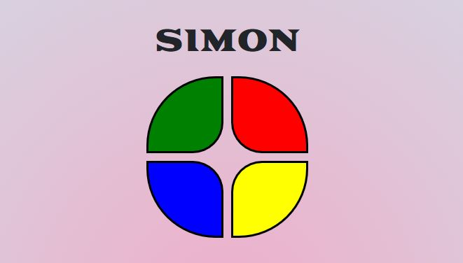

# Simon

Game 01 - Simon

Click [here](https://maxx105.github.io/simon/) to open the deployed application.

## Description
This is a very simple React-built version of the classic game, Simon

## Table of Contents 
* [Technologies](#Technologies) 
* [Usage](#Usage)
* [License](#License)
* [Badges](#Badges)
* [Test](#Test)
* [Questions](#Questions)

## Technologies
* This application is built with React and makes use of the useState and useEffect hooks.
* It uses local storage for saving a viewing high scores.
* It uses CSS/Bootstrap for styling.
* Deployed on Github pages

## Usage
If using from the Github pages deployed application, just go to the deployed application's [link](https://maxx105.github.io/simon/). Click the Start button to start which will initiate the game. One color will illuminate and you must click the same color. Then 2 random colors will illuminate consecutively and you must copy the pattern. It will continue to increment up by one until you get the pattern wrong. Once you lose, you will see your score and you can submit a score along with your initials which gets saved to the local storage. You can also view these scores as well.

## License
MIT

## Badges

 

## Tests
No tests are currently in place for this project. 

## Questions 
 For any questions, contact me at [maxxsanner105@gmail.com](mailto:maxxsanner105@gmail.com).
#### 

